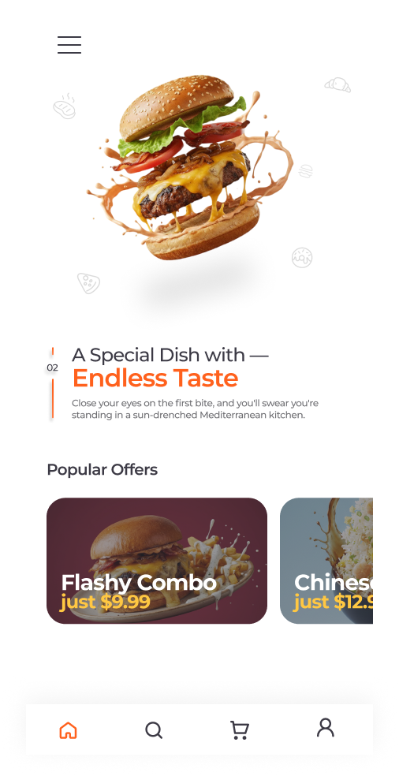
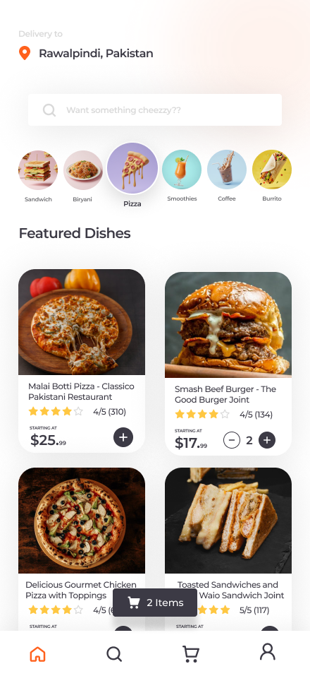
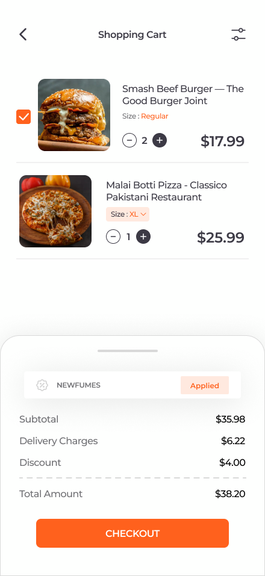

<div align="center">


# 🔥 FUMES

### *Your Food, Your Way, Delivered Today*

[](https://reactnative.dev)
[](https://expo.dev)
[](https://typescriptlang.org)
[](https://appwrite.io)

<br/>

> **FUMES** is a premium food delivery app built with React Native + Expo.
> Offline-first architecture, real-time cart management, and a buttery-smooth UI
> that makes ordering feel as good as eating.

<br/>

---

### 📲 Download & Test

[](https://github.com/the-shehryar/fumes-food-app/releases/latest)

> ⚠️ **APK link coming soon** — will be updated after the next EAS build.
> In the meantime, clone the repo and run locally with `npx expo start`.

---

</div>

<br/>

## ✨ What Makes FUMES Different

**Most food delivery apps are slow, bloated, and require constant internet.**  
FUMES takes a different approach:

- 🗄️ **Offline-first** — menus and categories are cached locally so the app loads instantly, even on bad connections
- ⚡ **Local search** — searching never hits the network unless the local cache is empty
- 🧠 **Smart state** — Zustand stores keep cart, auth, location, and search state in sync across every screen
- 🎨 **Zero UI libraries** — every component is hand-crafted, no generic look-alike components

<br/>

## 🌟 Features

| | Feature | Details |
|---|---|---|
| 🏠 | **Home Feed** | Hero offer banner + top-rated menu grid sorted by rating |
| 🔍 | **Search & Filter** | Category chips + keyword search, local-first with network fallback |
| 🛒 | **Cart** | Quantity controls, promo code validation, live bill summary |
| 🎟️ | **Promo Codes** | `NEWFUMES` (10% off), `SOUTH5` (5% off) and extensible coupon list |
| 📍 | **Location** | Auto-detects delivery address using device GPS |
| 📦 | **Orders** | Receipt history accessible from the header |
| 🔐 | **Auth** | Login/signup via Appwrite with persistent session |
| 💾 | **Caching** | Menu + category data persisted to AsyncStorage |
| 🖼️ | **Screenshots** | ViewShot integration for saving app screenshots to gallery |

<br/>

## 📸 Screenshots

| Home | Search | Cart | Profile |
|:---:|:---:|:---:|:---:|
|  |  |  |  |


<br/>

## 🏗️ Project Structure

```
fumes-food-app/
├── app/
│   ├── (tabs)/
│   │   ├── index.tsx           # Home — hero + trending grid
│   │   ├── search.tsx          # Search + category filter
│   │   └── cart.tsx            # Cart + coupon + checkout
│   ├── components/
│   │   ├── MenuCard.tsx        # Product card (grid item)
│   │   ├── CartItem.tsx        # Cart row with qty controls
│   │   ├── HeroSlider.tsx      # Offer banner carousel
│   │   ├── Filter.tsx          # Category chip bar
│   │   ├── SearchBar.tsx       # Search input with Zustand
│   │   ├── EmptyCart.tsx
│   │   └── skeletons/          # Loading placeholders
│   ├── checkout.tsx
│   └── orders.tsx
├── stores/                     # Zustand global state
│   ├── auth.store.ts           # User session
│   ├── cart.store.ts           # Cart items, coupons, totals
│   ├── location.store.ts       # Delivery address
│   ├── menus.store.ts          # Menu + category cache state
│   └── search.store.ts         # Search query + category
├── libs/
│   ├── appwrite.ts             # All Appwrite API calls
│   ├── asyncStorage.ts         # Local cache read/write
│   ├── helpers.ts              # Location permission + utils
│   └── useAppwrite.ts          # Data fetching hook
├── constants/
│   └── Colors.ts
├── types/
│   └── type.ts
└── app.json
```

<br/>

## 🎢 Fumes - User Flow


## 🎢 Fumes - Order Flow


## 🚀 Getting Started

### Prerequisites

- Node.js 18+
- [Expo CLI](https://docs.expo.dev/get-started/installation/)
- An [Appwrite](https://cloud.appwrite.io) project with a database set up
- Android Studio (for emulator) or a physical Android device

### 1. Clone & Install

```bash
git clone https://github.com/the-shehryar/fumes-food-app.git
cd fumes-food-app
npm install
```

### 2. Configure Appwrite

Update your credentials in `libs/appwrite.ts`:

```ts
const client = new Client()
  .setEndpoint("https://cloud.appwrite.io/v1")
  .setProject("YOUR_PROJECT_ID");
```

### 3. Run

```bash
npx expo start
# Press 'a' for Android emulator
# Scan QR code with Expo Go for physical device
```

<br/>

## 🧰 Tech Stack

| Layer | Technology |
|---|---|
| Framework | React Native + Expo SDK 55 |
| Language | TypeScript |
| Navigation | Expo Router (file-based) |
| State Management | Zustand |
| Backend | Appwrite (BaaS) |
| Local Storage | AsyncStorage |
| Location | Expo Location |
| Icons | Expo Vector Icons — Ionicons |
| Media | Expo Media Library + ViewShot |
| Build | EAS Build (Expo Application Services) |

<br/>

## 📦 Building the APK

### Preview build (installable APK)

```bash
eas build -p android --profile preview
```

Make sure your `eas.json` preview profile includes:

```json
"preview": {
  "distribution": "internal",
  "android": {
    "buildType": "apk"
  }
}
```

### Production build (Play Store AAB)

```bash
eas build -p android --profile production
```

<br/>

## ⚠️ Known Issues Being Fixed

- `expo-file-system` version conflict between `react-native-appwrite` and the main project
- `react-native-webview` peer dependency missing (required by `@sfpy/react-native`)
- `react-native-turbo-mock-location-detector` is unmaintained — evaluating alternatives

<br/>

## Try it out yourself

Get the app [Download Link](https://expo.dev/artifacts/eas/f4BLWs7Ua4XWZs3uiC8Bbw.apk) 

## 🤝 Contributing

1. Fork the repo
2. Create a branch: `git checkout -b feat/your-feature`
3. Commit: `git commit -m 'feat: add your feature'`
4. Push: `git push origin feat/your-feature`
5. Open a pull request

<br/>

## 📄 License

MIT © [Shehryar](https://github.com/the-shehryar)

<br/>

<div align="center">
  <sub>Built with 🔥 in Pakistan · Powered by Expo + Appwrite</sub>
</div>